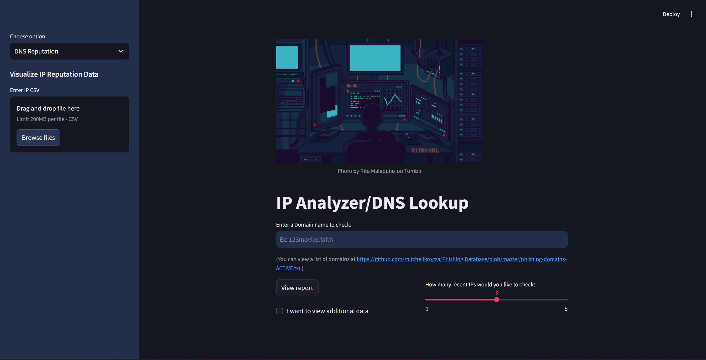
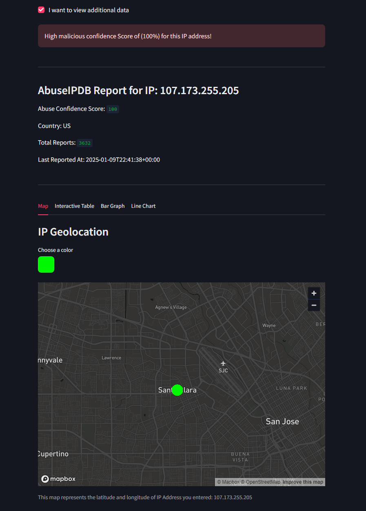
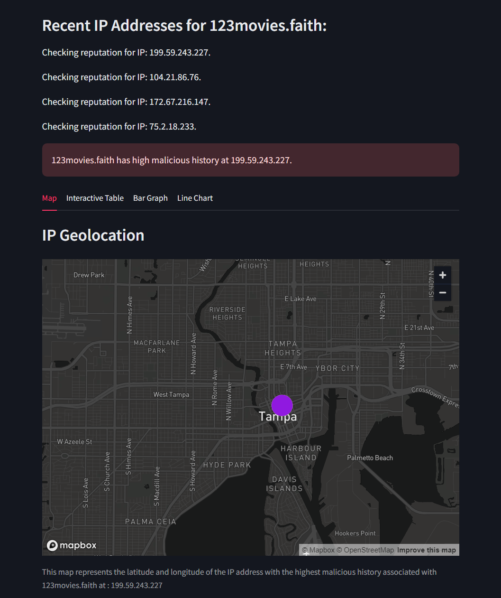

# IP Analyzer/DNS Lookup
<p align="center">
  
</p>

## Project Overview

This project aims to analyze the reputation of IP addresses and domain names to determine if they have a history of malicious activity. It serves two primary purposes:

1. Validating whether a website or domain is safe to visit.

2. Assessing the trustworthiness of incoming traffic from foreign IP addresses, similar to a firewall.

The project utilizes multiple APIs, including AbuseIPDB and SecurityTrails, and provides visualizations for data analysis using the Streamlit framework.

## Features

### IP Analyzer:

* Accepts an IPv4 or IPv6 address for analysis.

* Displays key metrics such as:

  - Abuse confidence score.

  - Total reports.

  - Last reported time.

  - Associated country and domain information.
* Provides feedback messages (success, warning, error) based on abuse score.

* Visualizations:

  - Interactive table for uploaded or default CSV data.

  - Geolocation map showing latitude and longitude of the IP.

  - Bar and line charts for phishing scores and report trends.
<p align="left">
  
</p>

### DNS Reputation Lookup:

* Accepts domain names for analysis.

* Fetches recent IP addresses associated with the domain.

* Calculates abuse scores for each IP and identifies the most malicious one.

* Visualizations similar to the IP Analyzer option.
<p align="left">
  
</p>

## Tech Stack

* Python: Core programming language.

* Streamlit: Framework for creating the web interface.

* Pandas: For data manipulation.

* Plotly: For creating visualizations.

* Requests: For API integration.

## Setup and Installation

### Prerequisites

* Python 3.7 or higher.

* API keys for:

  - AbuseIPDB [Sign up](https://www.abuseipdb.com/).

  - SecurityTrails [Sign up](https://securitytrails.com/).

### Steps

1. Clone the repository:
```console
git clone https://github.com/your-repo-name/IP-Analyzer.git
cd IP-Analyzer
```
2. Install dependencies:
```console
pip install -r requirements.txt
```
3. Set up API keys:

Create a file named api_key1.json in the project root.

Add the following content:
```python
{
    "abuseipdb_key": "YOUR_ABUSEIPDB_KEY",
    "securityTrails_key": "YOUR_SECURITYTRAILS_KEY"
}
```
4.Run the application:
```console
streamlit run Main.py
```
## How to Use

### IP Analyzer

* Navigate to the "IP Analyzer" option from the sidebar.

* Enter a valid IP address (e.g., 209.85.128.181).

* View reports and visualizations:

  - Abuse confidence score and report details.

  - Geolocation map.

  - Interactive CSV data table.

  - Bar and line charts for additional insights.

### DNS Reputation Lookup

* Navigate to the "DNS Reputation" option from the sidebar.

* Enter a domain name (e.g., example.com).

* Choose how many recent IPs to check using the slider.

* View:

  - Abuse scores for each associated IP.

  - Geolocation of the most malicious IP.


## Known Issues

* AbuseIPDB free tier limits the number of API calls per day.

* SecurityTrails API may not return results for all domains.

* Geolocation may fail for certain IPs due to incomplete data.

## Future Enhancements

* Integrate additional APIs for richer data insights.

* Improve UI/UX with enhanced visualizations and interactivity.

* Add a database for storing historical query results.

## Contributors

* Jonathan Nava-Arenas: [Github](https://github.com/navajonathan29)

* Kylie Caplin: [Github](https://github.com/kyliecaplin)

